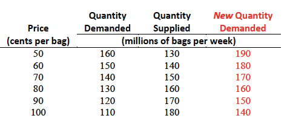

```{r setup, include=FALSE}
knitr::opts_chunk$set(echo = FALSE)
```

## Content

> - Custom problems
> - Problems 20, 21, 22, 23 (p.86)

## Key points

- **Competitive market**
- **Demand**, law of demand
- **Supply**, law of supply
- Market **equilibrium**
- When do we have **Surplus**?
- **Shortage**?

## Custom problem 1

> The $y$-intercept of a supply curve is 4. The slope is 2.

> 1. What is the equation of the supply curve?
> 2. Suppose that $Q_S = 5$. What is $P$?
> 3. Suppose that $P = \$12$. What is $Q_S$?

## Custom problem 1

1. $P = a + bQ_S$

      $a=4$, $b=2$
      
      $\implies$ $P=4+2Q_S$
      
2. $Q_s=5$

      $\implies$ $P=4+2(5)=14$

3. $(12) = 2+Q_S$ $\implies$ $Q_S=4$

___

{width=100%}

## Custom problem 2

> The $y$-intercept of a demand curve is 16. The slope is -4.

> 1. What is the equation of the demand curve?
> 2. Suppose that $Q_D = 3$. What is $P$?
> 3. Suppose that $P = \$12$. What is $Q_D$?

___

{width=90%}


## Custom problem 3

> Use your answers from Custom Problems 1 and 2 to answer the following questions.

> 1. Suppose the price of the good is $12. Is there a shortage or a surplus, and how does the price adjust?
> 2. Find the equilibrium price and the equilibrium quantity in this market.

___
{width=90%}


## Problem 3.20

> 1. Draw a graph of the potato chip market and mark in the equilibrium price and quantity.
> 2. If the price is 60 cents a bag, is there a shortage or a surplus, and how does the price adjust?

___
{width=90%}

___
{width=90%}

## Problem 3.21

> In Problem 3.20, a new dip increases the quantity of potato chips that people want to buy by 30 million bags per week at each price.

> 1. Does the demand for chips change? Does the supply of chips change? Describe the change.
> 2. How do the equilibrium price and equilibrium quantity of chips change?

___
{width=100%}

___ 
{width=90%}

## Problem 3.22

> In Problem 3.20, if a virus destroys potato crops and the quantity of potato chips produced decreases by 40 million bags a week at each price, how does the supply of chips change?

___
{width=100%}

___

{width=90%}


## Problem 3.23

> If the virus in Problem 3.22 hits just as the new dip in Problem 3.21 comes onto the market, how do the equilibrium price and equilibrium quantity of chips change?

___
{width=100%}

___
{width=90%}

## Recap

> - Equation of a line: $Y=a+bX$
> - Supply Curve (positive upward slope): $P = a + bQ_S$
> - Demand Curve (negative downward slope): $P = a - bQ_D$
> - Equilibrium: $Q_S = Q_D$
> - If $P>P_E \implies Q_S>Q_D \implies$ Surplus
> - If $P<P_E \implies Q_S<Q_D \implies$ Shortage

